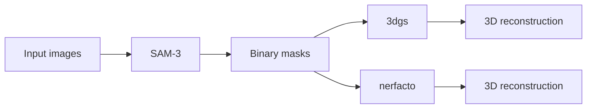

# DSL P6 Pipeline

Clone the repository with submodules:
```bash
git clone https://github.com/kezihlmann/dsl-p6-pipeline.git --recursive
# or, if you already cloned without --recursive:
# git submodule update --init --recursive
```

This repository runs a two-step plant reconstruction pipeline:

1. `step_1`: SAM3 mask generation
2. `step_2`: 3D reconstruction with either `3dgs` or `nerfacto`



The tested target is Euler. Local Linux use is possible with the same two-environment structure, but Euler is the documented path.

For local Linux use, mirror the same split:

- one environment for SAM3 + 3DGS
- one environment for Nerfacto

You can reuse the Euler environment files as a starting point, but you must adapt CUDA, compiler, and native extension installation to your own machine.

## Data Layout

`settings_pipeline.txt` points to an input folder that contains timestep folders such as:

```text
data/maize_4/
  timestep_2004/
    images/
    masks/                  # optional if step_1 will generate masks
    sparse/0/               # required for step_2
```

`step_2` requires a provided COLMAP sparse model in each timestep folder. The pipeline does not run COLMAP feature extraction or mapping.

## Main Entry Point

Run the pipeline with:

```bash
python scripts/run_pipeline.py --settings settings_pipeline.txt
```

`scripts/run_pipeline.py` will:

- run `step_1` in `dsl-p6-pipeline`
- run `step_2` with:
  - `dsl-p6-pipeline` for `3dgs`
  - `dsl-p6-nerfacto` for `nerfacto`

## Euler Setup

Use the short Euler guide in [SETUP_EULER.md](SETUP_EULER.md).

## Important Files

- `settings_pipeline.txt`: pipeline settings
- `environment-euler.yml`: SAM3 + 3DGS environment
- `environment-euler-nerfacto.yml`: Nerfacto environment
- `scripts/build_wheat_3dgs_extensions.py`: builds the Wheat-3DGS CUDA extensions
- `scripts/install_tinycudann_euler.py`: installs `tiny-cuda-nn` for the Nerfacto `tcnn` backend on Euler

## 3DGS Loss Modes — Report to Code Mapping

Direct correspondence between the loss objectives named in the report (§ Loss Functions) and the `--loss_mode` values in `experiments/3dgs_loss_experiments/scripts/train_mask_loss_3dgs.py`.

| Report objective | `--loss_mode` | Code file |
|---|---|---|
| Hard-masked RGB (strategy 1, §Foreground Masking) | main pipeline — `train_vanilla_3dgs.py` | `scripts/create_3dgs_reconstructions.py` |
| `L = L_rgb^M` (foreground-masked photometric only) | `masked_rgb` | `train_mask_loss_3dgs.py` |
| `L = L_rgb^M + λ_sil · L_sil` (RGB-derived silhouette) | **not implemented** | — |
| `L = L_rgb^M + λ_alpha · L_alpha` (opacity mask loss) | `rgb_alpha` | `train_mask_loss_3dgs.py` |

The two modes present in the code but not named as objectives in the report:

| `--loss_mode` | What it computes |
|---|---|
| `baseline` | Standard unmasked 3DGS loss: `(1−λ_dssim)·L1(Î,I) + λ_dssim·(1−SSIM(Î,I))` |
| `alpha` | Unmasked RGB loss + `λ_alpha·L_alpha` (no foreground masking on the RGB term) |
| `foreground_background` | `L_1^M + λ_alpha·L_alpha + λ_bg·mean(Â[M=0])` |

### Discrepancies to fix in the report

1. **`L_sil` training objective is not implemented.** The report lists `L = L_rgb^M + λ_sil·L_sil` as a tested loss, but no `loss_mode` computes it. `L_sil` is only used at evaluation time. Fix: remove this objective from the report, or implement it.
2. **`masked_rgb` and `rgb_alpha` compute `L_1^M`, not `L_rgb^M`.** The code does `masked_mean(|Î−I|, M)` — masked L1 only. The report's `L_rgb^M` additionally includes `λ_dssim·(1−SSIM(M⊙Î, M⊙I))`. Fix: either drop the masked D-SSIM term from the report formula (rename to `L_1^M`), or add it to the code.
3. **Main pipeline (`train_vanilla_3dgs.py`) ≠ `L_rgb^M`.** The GT image is pre-multiplied by `M` and the loss runs over all pixels with background GT = 0. The report's `L_rgb^M` averages only over foreground pixels. These are different losses and should not be described interchangeably in the report.

## Notes

- `3dgs` depends on `external/Wheat-3DGS`.
- `nerfacto` uses the repository's built-in training and rendering workflow.
- For evaluation, 3DGS uses held-out test cameras `{2, 6, 10, 14, 18, 21}`; 4DGS uses held-out test cameras `{16, 17, 18, 19, 20, 21}`. Nerfacto uses its default code-defined test split.
- Large local experiment outputs under `data/` are ignored by Git.
