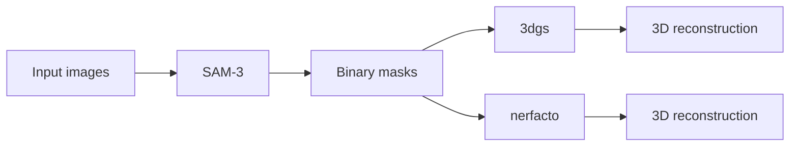

# DSL P6 Pipeline

Clone the repository with submodules:
```bash
git clone https://github.com/kezihlmann/dsl-p6-pipeline.git --recursive
# or, if you already cloned without --recursive:
# git submodule update --init --recursive
```

This repository runs a two-step plant reconstruction pipeline:

1. `step_1`: SAM3 mask generation
2. `step_2`: 3D reconstruction with either `3dgs` or `nerfacto`



The tested target is Euler. Local Linux use is possible with the same two-environment structure, but Euler is the documented path.

For local Linux use, mirror the same split:

- one environment for SAM3 + 3DGS
- one environment for Nerfacto

You can reuse the Euler environment files as a starting point, but you must adapt CUDA, compiler, and native extension installation to your own machine.

## Data Layout

`settings_pipeline.txt` points to an input folder that contains timestep folders such as:

```text
data/maize_4/
  timestep_2004/
    images/
    masks/                  # optional if step_1 will generate masks
    sparse/0/               # required for step_2
```

`step_2` requires a provided COLMAP sparse model in each timestep folder. The pipeline does not run COLMAP feature extraction or mapping.

## Main Entry Point

Run the pipeline with:

```bash
python scripts/run_pipeline.py --settings settings_pipeline.txt
```

`scripts/run_pipeline.py` will:

- run `step_1` in `dsl-p6-pipeline`
- run `step_2` with:
  - `dsl-p6-pipeline` for `3dgs`
  - `dsl-p6-nerfacto` for `nerfacto`

## Euler Setup

Use the short Euler guide in [SETUP_EULER.md](SETUP_EULER.md).

## Important Files

- `settings_pipeline.txt`: pipeline settings
- `environment-euler.yml`: SAM3 + 3DGS environment
- `environment-euler-nerfacto.yml`: Nerfacto environment
- `scripts/build_wheat_3dgs_extensions.py`: builds the Wheat-3DGS CUDA extensions
- `scripts/install_tinycudann_euler.py`: installs `tiny-cuda-nn` for the Nerfacto `tcnn` backend on Euler

## 3DGS Loss Modes

The 3DGS training supports several loss modes.  The **main pipeline** uses `train_vanilla_3dgs.py`; the **ablation experiments** use `train_mask_loss_3dgs.py` with an explicit `--loss_mode` flag.

### Main pipeline (`train_vanilla_3dgs.py`)

The GT image is pre-multiplied by the binary plant mask before any loss is computed.  The standard 3DGS objective (L1 + D-SSIM) then runs over **all pixels**:

```
L = (1 − λ_dssim) · L1(Î, M⊙I)  +  λ_dssim · (1 − SSIM(Î, M⊙I))
```

Background pixels have GT = 0, so the renderer is trained to produce black outside the mask.  This is the **hard-masked RGB** strategy described in the report (§ Foreground Masking, strategy 1).

### Ablation loss modes (`train_mask_loss_3dgs.py`)

| `--loss_mode` | Formula | Report correspondence |
|---|---|---|
| `baseline` | `L1(Î, I) + DSSIM(Î, I)` — full image, no masking | Unmasked baseline |
| `masked_rgb` | `masked_mean(\|Î−I\|, M)` — foreground pixels only, **no SSIM** | Closest to report's $\mathcal{L}_\text{rgb}^M$ (report also includes masked D-SSIM; code drops it) |
| `alpha` | full-image L1+DSSIM + `λ · BCE(Â, M)` | Unmasked photometric + opacity supervision |
| `rgb_alpha` | `masked_L1` + `λ · BCE(Â, M)` | Report's opacity/alpha mask loss objective: $\mathcal{L}_\text{rgb}^M + \lambda_\text{alpha}\mathcal{L}_\text{alpha}$ (same caveat: no SSIM in the masked RGB term) |
| `foreground_background` | `masked_L1` + `λ · BCE(Â, M)` + `λ_bg · mean(Â[background])` | Not in report — adds an explicit background opacity penalty |

`Â` is the accumulated opacity map output by the rasterizer.  `BCE(Â, M)` is binary cross-entropy between the rendered opacity and the plant mask, implemented in `alpha_loss()`.

### Accuracy notes (report vs. code)

1. **RGB-derived silhouette loss ($\mathcal{L}_\text{sil}$) is not used for training.**  The report describes it as a training loss, but no `loss_mode` implements it.  It appears only in evaluation (`compute_plant_metrics.py`: `pred_gray > 0.01`).
2. **Masked D-SSIM is missing from `masked_rgb` / `rgb_alpha`.**  The report defines $\mathcal{L}_\text{rgb}^M$ with both masked L1 and masked D-SSIM; the code only computes masked L1.
3. **Main pipeline loss ≠ $\mathcal{L}_\text{rgb}^M$.**  `train_vanilla_3dgs.py` zeros the GT outside the mask and runs the loss over all pixels, while the report's formula averages only over foreground pixels.

## Notes

- `3dgs` depends on `external/Wheat-3DGS`.
- `nerfacto` uses the repository's built-in training and rendering workflow.
- For evaluation, 3DGS uses held-out test cameras `{2, 6, 10, 14, 18, 21}`; 4DGS uses held-out test cameras `{16, 17, 18, 19, 20, 21}`. Nerfacto uses its default code-defined test split.
- Large local experiment outputs under `data/` are ignored by Git.
