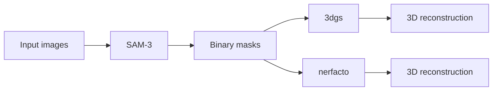

# DSL P6 Pipeline

Clone the repository with submodules:
```bash
git clone https://github.com/kezihlmann/dsl-p6-pipeline.git --recursive
# or, if you already cloned without --recursive:
# git submodule update --init --recursive
```

This repository runs a two-step plant reconstruction pipeline:

1. `step_1`: SAM3 mask generation
2. `step_2`: 3D reconstruction with either `3dgs` or `nerfacto`



The tested target is Euler. Local Linux use is possible with the same two-environment structure, but Euler is the documented path.

For local Linux use, mirror the same split:

- one environment for SAM3 + 3DGS
- one environment for Nerfacto

You can reuse the Euler environment files as a starting point, but you must adapt CUDA, compiler, and native extension installation to your own machine.

## Data Layout

`settings_pipeline.txt` points to an input folder that contains timestep folders such as:

```text
data/maize_4/
  timestep_2004/
    images/
    masks/                  # optional if step_1 will generate masks
    sparse/0/               # required for step_2
```

`step_2` requires a provided COLMAP sparse model in each timestep folder. The pipeline does not run COLMAP feature extraction or mapping.

## Main Entry Point

Run the pipeline with:

```bash
python scripts/run_pipeline.py --settings settings_pipeline.txt
```

`scripts/run_pipeline.py` will:

- run `step_1` in `dsl-p6-pipeline`
- run `step_2` with:
  - `dsl-p6-pipeline` for `3dgs`
  - `dsl-p6-nerfacto` for `nerfacto`

## Euler Setup

Use the short Euler guide in [SETUP_EULER.md](SETUP_EULER.md).

## Important Files

- `settings_pipeline.txt`: pipeline settings
- `environment-euler.yml`: SAM3 + 3DGS environment
- `environment-euler-nerfacto.yml`: Nerfacto environment
- `scripts/build_wheat_3dgs_extensions.py`: builds the Wheat-3DGS CUDA extensions
- `scripts/install_tinycudann_euler.py`: installs `tiny-cuda-nn` for the Nerfacto `tcnn` backend on Euler

## 3DGS Loss Modes

Notation is identical to the report.
`M` = binary plant mask, `I` = GT image, `Î` = rendered image, `Â` = accumulated opacity, `Ω` = image domain.

The report defines these building blocks:

```
L_1^M  =  ( Σ_p M_p |Î_p − I_p| ) / ( Σ_p M_p + ε )

L_rgb^M  =  (1 − λ_dssim) · L_1^M  +  λ_dssim · (1 − SSIM(M⊙Î, M⊙I))

L_alpha  =  −(1/|Ω|) Σ_p [ M_p·log(Â_p+ε) + (1−M_p)·log(1−Â_p+ε) ]

L_sil  =  (1/|Ω|) Σ_p | M̂_p^rgb − M_p |
          where  M̂_p^rgb = Σ_c |Î_{p,c}| / ( max_q Σ_c |Î_{q,c}| + ε )
```

### What each loss mode actually computes

The **ablation experiments** use `experiments/3dgs_loss_experiments/scripts/train_mask_loss_3dgs.py`
with `--loss_mode`.

| `--loss_mode` | What the code computes | Report objective it is meant to implement |
|---|---|---|
| `baseline` | `(1−λ_dssim)·L1(Î,I) + λ_dssim·(1−SSIM(Î,I))` over all pixels | Unmasked 3DGS baseline — no corresponding named loss in report |
| `masked_rgb` | **`L_1^M` only** | `L_rgb^M` — ⚠ masked D-SSIM term is absent |
| `alpha` | `(1−λ)·L1(Î,I) + λ·(1−SSIM(Î,I))  +  λ_alpha·L_alpha` (unmasked RGB) | Not described as a standalone objective in the report |
| `rgb_alpha` | **`L_1^M  +  λ_alpha·L_alpha`** | `L_rgb^M + λ_alpha·L_alpha` — ⚠ masked D-SSIM term is absent |
| `foreground_background` | `L_1^M + λ_alpha·L_alpha + λ_bg·mean(Â[M=0])` | Not in the report |

### Main pipeline (`train_vanilla_3dgs.py`)

The GT image is **pre-multiplied** by `M` before any loss (`original_image *= gt_alpha_mask`), then the standard 3DGS loss runs over all pixels:

```
L  =  (1−λ_dssim)·L1(Î, M⊙I)  +  λ_dssim·(1−SSIM(Î, M⊙I))   [all pixels, background GT = 0]
```

This is **not the same as `L_rgb^M`**: the sum runs over every pixel (background GT is 0, not excluded), whereas `L_rgb^M` averages only over foreground pixels `M_p = 1`.
This corresponds to the **hard-masked RGB** strategy in the report (§ Foreground Masking, strategy 1).

### Discrepancies between code and report — items to fix in the report

1. **`L_sil` is never used for training.** The report defines it and lists `L = L_rgb^M + λ_sil·L_sil` as a tested objective, but no `loss_mode` computes it. `L_sil` only appears at evaluation time (`pred_gray > 0.01` in `compute_plant_metrics.py`). → Either remove the silhouette-loss training objective from the report, or implement it.
2. **`masked_rgb` and `rgb_alpha` compute `L_1^M`, not `L_rgb^M`.** The masked D-SSIM term `λ_dssim·(1−SSIM(M⊙Î, M⊙I))` is missing from both modes. → Either simplify the report formula to `L_1^M`, or add the SSIM term to the code.
3. **Main pipeline loss ≠ `L_rgb^M`.** The report should clarify that the hard-masked strategy averages over all pixels (background forced to 0), not just foreground pixels as `L_rgb^M` does.

## Notes

- `3dgs` depends on `external/Wheat-3DGS`.
- `nerfacto` uses the repository's built-in training and rendering workflow.
- For evaluation, 3DGS uses held-out test cameras `{2, 6, 10, 14, 18, 21}`; 4DGS uses held-out test cameras `{16, 17, 18, 19, 20, 21}`. Nerfacto uses its default code-defined test split.
- Large local experiment outputs under `data/` are ignored by Git.
